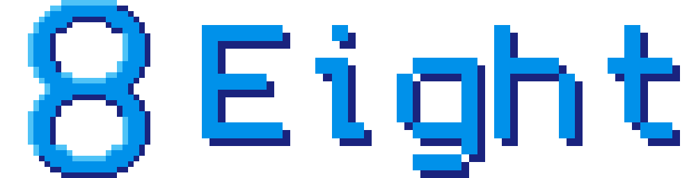

[![Contributors][contributors-shield]][contributors-url]
[![Forks][forks-shield]][forks-url]
[![Stargazers][stars-shield]][stars-url]
[![Issues][issues-shield]][issues-url]
[![MIT License][license-shield]][license-url]

Eight is a sandboxed environment for playing safely with Lua and its drawable canvas.

[![Discord Invite][discord-banner]][discord-url]

[contributors-shield]: https://img.shields.io/github/contributors/Ale32bit/Eight.svg?style=flat-square
[contributors-url]: https://github.com/Ale32bit/Eight/graphs/contributors
[forks-shield]: https://img.shields.io/github/forks/Ale32bit/Eight.svg?style=flat-square
[forks-url]: https://github.com/Ale32bit/Eight/network/members
[stars-shield]: https://img.shields.io/github/stars/Ale32bit/Eight.svg?style=flat-square
[stars-url]: https://github.com/Ale32bit/Eight/stargazers
[issues-shield]: https://img.shields.io/github/issues/Ale32bit/Eight.svg?style=flat-square
[issues-url]: https://github.com/Ale32bit/Eight/issues
[license-shield]: https://img.shields.io/github/license/Ale32bit/Eight.svg?style=flat-square
[license-url]: https://github.com/Ale32bit/Eight/blob/master/LICENSE
[discord-banner]: https://discordapp.com/api/guilds/387712125210198016/widget.png?style=banner3
[discord-url]: https://discord.gg/Gm5wffD
